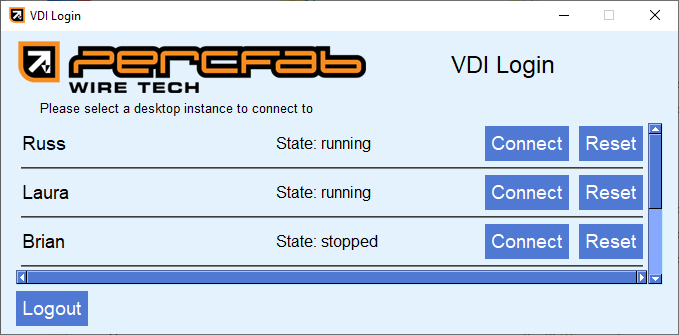

# PVE VDI Client

This project's focus is to create a simple VDI client intended for mass deployment. This VDI client connects directly to Proxmox VE and allows users to connect (via Spice) to any VMs they have permission to access.

## Windows Installation

You **MUST** install virt-viewer prior to using PVE VDI client, you may download it from the [official Virtual Machine Manager](https://virt-manager.org/download) site.

Please visit the [releases](https://github.com/PercFab/PercFab_PVE-VDIClient/releases) section to download a prebuilt MSI package

If you need to customize the installation, such as to sign the executable and MSI, you may download and install the [WIX toolset](https://wixtoolset.org/releases/) and use the build_vdiclient.bat file to build a new MSI.

you will need to download the latest 3.10 python release, and run the following commands to install the necessary packages:

    requirements.bat

## Linux Installation

Run the following commands on a Debian/Ubuntu Linux system to install the appropriate prerequisites

    apt install python3-pip python3-tk virt-viewer git
    git clone https://github.com/PercFab/PercFab_PVE-VDIClient.git
    cd ./PercFab_PVE-VDIClient/
    chmod +x requirements.sh
    ./requirements.sh
    cp vdiclient.py /usr/local/bin
    chmod +x /usr/local/bin/vdiclient.py

## Configuration File

PVE VDI Client **REQUIRES** a configuration file to function. The client searches for this file in the following locations unless **--config** is specified on the commmand line:

* Windows
    * %APPDATA%\PercFabVDIClient\vdiclient.ini
    * %PROGRAMFILES%\PercFabVDIClient\vdiclient.ini
* Linux
    * ~/.config/PercFabVDIClient/vdiclient.ini
    * /etc/PercFabvdiclient/vdiclient.ini
    * /usr/local/etc/PercFabvdiclient/vdiclient.ini

Please refer to **vdiclient.ini.example** for all available config file options

If you encounter any issues feel free to submit an issue report.

## Proxmox Permission Requirements

Users that are accessing VDI instances need to have the following permissions assigned for each VM they access:

* VM.PowerMgmt
* VM.Console
* VM.Audit
